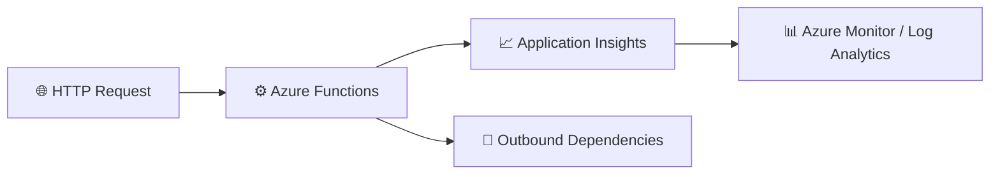

# Consolidated Lab – Azure Functions Monitoring with Application Insights

<style>
a {
    text-decoration: none;
    color: #464feb;
}
tr th, tr td {
    border: 1px solid #e6e6e6;
}
tr th {
    background-color: #f5f5f5;
}
</style>

This single, detailed lab replaces the earlier split labs and provides one complete end-to-end experience for monitoring Azure Functions with Application Insights, Azure Monitor, Log Analytics, and Kusto Query Language (KQL).

The goal is to walk you through the full lifecycle of observability in one continuous flow:

1. create the monitoring resources
2. open and prepare the existing Azure Function App
3. deploy a simple HealthCheck function from VS Code
4. generate telemetry
5. validate health and performance
6. investigate failures
7. trace dependencies
8. configure alerts
9. create a reusable Azure Operations Dashboard for the operations team

By the end of this lab, you will be able to operate confidently with telemetry data in Azure and explain how to diagnose issues in a function-based application.

---

## What you will learn

After completing this lab, you will be able to:

- create and connect Azure monitoring resources to an Azure Function
- verify telemetry such as requests, traces, exceptions, and dependencies
- use KQL to investigate performance and failures
- correlate telemetry using operation identifiers
- identify dependency-related issues and likely root causes
- configure basic alerting for proactive monitoring
- create and share a reusable Azure Operations Dashboard using Application Insights telemetry

---

## Architecture at a glance



This lab covers the full monitoring path from request to insight, using the same Function App and telemetry flow throughout the exercises.

---

## Prerequisites

Before you begin, make sure you have:

- an Azure subscription
- access to the Azure portal
- permission to create resources
- Visual Studio Code
- Azure Functions extension
- Azure Account extension
- Azure Functions Core Tools v4
- PowerShell 7

### Verify your local environment

Run the following commands:

```bash
func --version
pwsh --version
```

Expected results:

- Azure Functions Core Tools v4 is installed
- PowerShell 7 is available

---

## Exercise 1 – Create the monitoring foundation

### Step 1.1 – Create a resource group

1. Open the Azure portal.
2. Go to Resource Groups.
3. Select Create.
4. Use the following values:

| Setting | Value |
| --- | --- |
| Resource Group | MonitoredAssets |
| Region | East US |

5. Review and create the resource group.

✅ Expected result: the resource group is created successfully.

### Step 1.2 – Create Application Insights

1. In the Azure portal, search for Application Insights.
2. Select Create.
3. Use the following values:

| Setting | Value |
| --- | --- |
| Name | instrm-yourname |
| Resource Group | MonitoredAssets |
| Region | East US |
| Workspace | Default |

4. Review and create the resource.

✅ Expected result: Application Insights is provisioned.

### Step 1.3 – Record the connection string

1. Open your Application Insights resource.
2. Go to Properties.
3. Copy the Connection String value.
4. Save it for later use.

Example:

```text
InstrumentationKey=xxxxxxxx-xxxx-xxxx-xxxx-xxxxxxxxxxxx;
IngestionEndpoint=https://eastus-8.in.applicationinsights.azure.com/
```

---

## Exercise 2 – Open and validate the existing Flex Consumption Function App

### Step 2.1 – Open the Function App in Azure Portal

1. Sign in to the Azure portal.
2. Navigate to the resource group:

```text
MonitoredAssets
```

3. Open the Function App named:

```text
bcfu-functions
```

4. Verify the following settings:

| Setting | Expected value |
| --- | --- |
| Status | Running |
| Operating system | Linux |
| Hosting plan | Flex Consumption |
| Memory | 512 MB |

✅ Expected result: the Function App exists and is ready for deployment.

### Step 2.2 – Review the deployment experience

When you open the Function App, you should see the message:

```text
Create functions in your preferred environment
```

with deployment options including:

- VS Code Desktop
- Other editors / CLI

This confirms that the Function App has been created, but no function has been deployed yet.

---

## Exercise 3 – Telemetry Validation Using Azure Functions

### Objective

Create a lightweight Azure Function that generates telemetry for monitoring validation.

This function becomes the monitored workload used in:

- Telemetry Readiness Assessment
- Failure Investigation
- Operational Pattern Analysis
- Dashboard Design
- Workbook Design
- Alert Strategy Design

### Step 3.1 – Validate existing Function App

Verify that the Azure Function App already exists.

| Setting | Value |
| --- | --- |
| Function App | bcfu-functions |
| Resource Group | MonitoredAssets |
| Hosting Plan | Flex Consumption |
| OS | Linux |
| Runtime | PowerShell |
| Status | Running |

Expected result:

```text
Function App available and healthy.
```

### Step 3.2 – Create HTTP trigger function

Create the function with the following values:

| Setting | Value |
| --- | --- |
| Function Name | HealthCheck |
| Trigger Type | HTTP Trigger |
| Authorization | Anonymous |

Expected result:

```text
HealthCheck function appears under the Functions blade.
```

### Step 3.3 – Implement telemetry logic

Deploy the following function logic:

```powershell
using namespace System.Net

param($Request, $TriggerMetadata)

Write-Host "HealthCheck Function Executed"

$body = @{
    Status    = "Healthy"
    Message   = "Telemetry validation successful"
    Timestamp = (Get-Date).ToUniversalTime().ToString("o")
}

Push-OutputBinding -Name Response -Value (
    [HttpResponseContext]@{
        StatusCode = [HttpStatusCode]::OK
        Body       = ($body | ConvertTo-Json)
    }
)
```

Telemetry generated:

| Signal | Result |
| --- | --- |
| Request Telemetry | Yes |
| Trace Telemetry | Yes |
| Response Duration | Yes |
| operation_Id | Yes |
| Success Status | Yes |

### Step 3.4 – Start function host

Run:

```powershell
func start
```

Expected output:

```text
Functions:

HealthCheck:
  [GET, POST]

http://localhost:7071/api/HealthCheck
```

### Step 3.5 – Execute function

Open this URL in the browser:

```text
http://localhost:7071/api/HealthCheck
```

Expected result:

```json
{
  "Message": "Telemetry validation successful",
  "Timestamp": "2026-07-31T01:34:43.3961978Z",
  "Status": "Healthy"
}
```

✅ Validation complete.

### Step 3.6 – Generate test telemetry

Generate multiple requests:

```powershell
1..20 | ForEach-Object {
    Invoke-RestMethod `
      -Uri "http://localhost:7071/api/HealthCheck"
}
```

Purpose: create enough telemetry for:

- Investigation
- Dashboards
- Workbooks
- Alert Testing

### Step 3.7 – Validate requests

Application Insights query:

```kusto
requests
| order by timestamp desc
```

Verify:

- Request Name
- ResultCode
- Success
- Duration
- operation_Id

### Step 3.8 – Validate traces

```kusto
traces
| order by timestamp desc
```

Verify that:

```text
HealthCheck Function Executed
```

appears.

### Step 3.9 – Telemetry readiness assessment

Run:

```kusto
union requests, dependencies, exceptions, traces
| summarize Records=count() by $table
| order by Records desc
```

Document:

| Category | Result |
| --- | --- |
| Requests | Present |
| Traces | Present |
| Exceptions | Review |
| Dependencies | Review |
| Correlation IDs | Present |
| Monitoring Ready | Yes |

---

## Phase 4 – Azure Operations Dashboard and Workbook Design

### Objective

Use the telemetry generated by the HealthCheck function to:

- Visualize application health
- Build operational dashboards
- Create investigation views
- Demonstrate monitoring value
- Identify monitoring gaps
- Support future-state monitoring recommendations

### Phase 4.1 – Validate telemetry before building visuals

#### Goal

Confirm telemetry exists before creating dashboards.

Open:

```text
Azure Portal -> Application Insights -> Logs
```

Query 1 - Request validation:

```kusto
requests
| order by timestamp desc
```

Verify:

| Item | Expected |
| --- | --- |
| Request Name | HealthCheck |
| Success | True |
| Result Code | 200 |
| Duration | Present |
| operation_Id | Present |

Query 2 - Trace validation:

```kusto
traces
| order by timestamp desc
```

Verify:

| Item | Expected |
| --- | --- |
| Message | HealthCheck Function Executed |
| Timestamp | Recent |
| Severity | Information |

Query 3 - Telemetry inventory:

```kusto
union requests, traces, dependencies, exceptions
| summarize Records=count() by $table
```

Expected:

| Table | Records |
| --- | --- |
| requests | populated |
| traces | populated |
| dependencies | optional |
| exceptions | optional |

Deliverable: Telemetry readiness confirmation.

### Phase 4.2 – Create Azure dashboard

#### Goal

Build a customer-facing operations dashboard.

Steps:

1. Open Azure Portal.
2. Search for Dashboard.
3. Select Dashboard.
4. Select Create.
5. Select Custom Dashboard.
6. Set dashboard name to:

```text
BFCU-Monitoring-PoC
```

7. Save the dashboard.

### Phase 4.3 – Create Request Volume tile

#### Goal

Visualize workload activity.

Query:

```kusto
requests
| summarize RequestCount=count() by bin(timestamp, 1m)
| order by timestamp asc
| render timechart
```

Pin to dashboard with tile name:

```text
Request Volume
```

Customer discussion questions:

- How many transactions occur?
- Are requests increasing?
- Is workload usage predictable?

Deliverable: Request volume visualization.

### Phase 4.4 – Create Success Rate tile

#### Goal

Show service reliability.

Query:

```kusto
requests
| summarize
    Total=count(),
    Successful=countif(success == true)
| extend SuccessRate = todouble(Successful) * 100 / Total
```

Expected:

| Metric | Example |
| --- | --- |
| Total Requests | 20 |
| Success Rate | 100% |

Pin to dashboard with tile name:

```text
Request Success %
```

Customer discussion questions:

- What defines service health?
- What percentage requires action?
- What SLA target exists?

Deliverable: Availability measurement.

### Phase 4.5 – Create Recent Operations tile

#### Goal

Provide an investigation starting point.

Query:

```kusto
requests
| order by timestamp desc
| project
    timestamp,
    name,
    success,
    resultCode,
    duration,
    operation_Id
| take 20
```

Pin to dashboard with tile name:

```text
Recent Operations
```

Customer discussion questions:

- What happened most recently?
- Which requests are failing?
- How quickly can Operations identify issues?

Deliverable: Operational investigation view.

### Phase 4.6 – Create Exception Trend tile

#### Goal

Track application failures.

Query:

```kusto
exceptions
| summarize ExceptionCount=count() by bin(timestamp, 1h)
| render timechart
```

Pin to dashboard with tile name:

```text
Exception Trend
```

Monitoring discussion questions:

- Which failures happen repeatedly?
- Are failures increasing?
- What deserves alerting?

Deliverable: Failure trend view.

### Phase 4.7 – Create Top Exception Types tile

#### Goal

Identify the largest failure sources.

Query:

```kusto
exceptions
| summarize Count=count() by type
| top 10 by Count
| render piechart
```

Pin to dashboard with tile name:

```text
Top Exception Types
```

Deliverable: Exception analysis dashboard.

### Phase 4.8 – Create Response Duration tile

#### Goal

Measure system performance.

Query:

```kusto
requests
| summarize AvgDuration=avg(duration) by bin(timestamp, 1m)
| render timechart
```

Pin to dashboard with tile name:

```text
Average Response Time
```

Customer discussion questions:

- What is acceptable latency?
- What causes slow performance?
- What would trigger escalation?

Deliverable: Performance monitoring view.

### Phase 4.9 – Create Operations Runbook panel

Add a Markdown tile with:

```markdown
# BFCU Monitoring Operations
1. Review Failed Requests
2. Review Exceptions
3. Review Recent Operations
4. Locate operation_Id
5. Correlate Requests and Traces
6. Determine Failure Boundary
7. Escalate to Owner

Monitoring data helps identify the visible failure boundary but may not prove root cause.
```

### Phase 4.10 – Dashboard layout

Row 1:

- Request Volume
- Request Success %
- Average Response Time

Row 2:

- Exception Trend
- Top Exception Types

Row 3:

- Recent Operations

Row 4:

- Application Map (if available)

Row 5:

- Operations Runbook

### Phase 4.11 – Workbook blueprint

After dashboard creation, discuss future workbook requirements.

Executive workbook should show:

- Overall health
- Availability
- Open critical alerts
- Incident trends

Operations workbook should show:

- Failed requests
- Exceptions
- Dependencies
- Latency

Investigation workbook should show:

- operation_Id
- Requests
- Traces
- Exceptions
- Correlation timelines

---

## Exercise 5 – Validate telemetry in Application Insights

At this point, the HealthCheck function is generating telemetry. The next steps show how to verify that the monitoring pipeline is working end to end.

### Step 5.1 – Open Application Insights logs

1. Go to your Application Insights resource.
2. Open Logs.

### Step 5.2 – Review requests

Run the following query:

```kusto
requests
| order by timestamp desc
```

Look for:

- timestamp
- name
- success
- duration
- operation_Id

### Step 5.3 – Review traces

Run:

```kusto
traces
| order by timestamp desc
```

Look for a message such as:

```text
HealthCheck Function Executed
```

### Step 5.4 – Review exceptions

Run:

```kusto
exceptions
| order by timestamp desc
```

✅ Expected result: telemetry is visible and can be inspected in the logs experience.

---

## Exercise 6 – Investigate a known failure

Once the baseline telemetry is visible, the next step is to create a controlled failure so you can practice investigating what the monitoring tools show.

### Step 6.1 – Simulate a downstream failure

Update the function to make an outbound HTTP call to an invalid endpoint so the request fails.

Example (PowerShell):

```powershell
using namespace System.Net

param($Request, $TriggerMetadata)

Write-Host "HealthCheck Function Executed"

try {
    Write-Host "Calling downstream dependency"

    # example.invalid is intentionally unreachable for failure simulation
    $null = Invoke-RestMethod -Uri "https://example.invalid/health" -Method Get -TimeoutSec 5

    $body = @{
        Status    = "Healthy"
        Message   = "Dependency call succeeded"
        Timestamp = (Get-Date).ToUniversalTime()
    } | ConvertTo-Json

    Push-OutputBinding -Name Response -Value (
        [HttpResponseContext]@{
            StatusCode = [HttpStatusCode]::OK
            Body       = $body
            Headers    = @{ "Content-Type" = "application/json" }
        }
    )
}
catch {
    Write-Host "Dependency call failed"
    throw
}
```

### Step 6.2 – Invoke the function again

1. Save the change.
2. Run the function from the portal.
3. Expect the request to fail.

### Step 6.3 – Query failed requests

Run:

```kusto
requests
| where success == false
| order by timestamp desc
```

### Step 6.4 – Review exception telemetry

Run:

```kusto
exceptions
| order by timestamp desc
```

### Step 6.5 – Correlate telemetry with operation_Id

Capture the operation_Id from the failed request and use it in the following queries:

```kusto
requests
| where operation_Id == "PASTE_ID"
```

```kusto
exceptions
| where operation_Id == "PASTE_ID"
```

```kusto
union requests, exceptions, dependencies
| where operation_Id == "PASTE_ID"
| order by timestamp asc
```

✅ Expected result: you can reconstruct the execution path and determine where the failure occurred.

---

## Exercise 7 – Trace dependencies

### Step 7.1 – Review dependency telemetry

Run:

```kusto
dependencies
| order by timestamp desc
```

Look for:

- target
- name
- success
- resultCode
- duration
- operation_Id

### Step 7.2 – Find failed dependencies

Run:

```kusto
dependencies
| where success == false
| order by timestamp desc
```

### Step 7.3 – Identify slow dependencies

Run:

```kusto
dependencies
| summarize AvgDurationMs = avg(duration), MaxDurationMs = max(duration) by name, target
| order by AvgDurationMs desc
```

✅ Expected result: you can tell whether the issue is inside the function or caused by an external dependency.

---

## Exercise 8 – Use KQL for practical investigations

### Step 8.1 – Count requests by function

```kusto
requests
| summarize RequestCount = count() by name
| order by RequestCount desc
```

### Step 8.2 – Average response time

```kusto
requests
| summarize AvgDurationMs = avg(duration) by name
```

### Step 8.3 – Show failures from the last 30 minutes

```kusto
requests
| where timestamp > ago(30m)
| where success == false
| project timestamp, name, duration, operation_Id, resultCode
| order by timestamp desc
```

✅ Expected result: you can turn raw logs into meaningful investigation views.

---

## Exercise 9 – Configure alerts and health monitoring

### Step 9.1 – Review health signals

1. Open your Application Insights resource.
2. Review the Overview and Metrics pages.
3. Look for request volume, failures, and availability information.

### Step 9.2 – Create an alert rule

1. Open Azure Monitor.
2. Go to Alerts.
3. Select Create and then Alert rule.
4. Select your Function App or Application Insights resource as the scope.
5. Define a simple condition such as:
   - failed requests greater than 0
   - for a short time window such as 5 minutes
6. Add an action group and notification destination.
7. Save the alert rule.

### Step 9.3 – Validate the alert setup

Trigger a failure and verify that the alert becomes active or appears in alert history.

✅ Expected result: you understand how to turn telemetry into proactive operational monitoring.

---

## Exercise 10 – Dashboard handoff and validation

Phase 4 is the authoritative implementation section for dashboard and workbook design.

Use this exercise to validate that the Phase 4 outputs are complete and ready for operations handoff.

### Step 10.1 – Confirm Phase 4 deliverables

Verify that the following were completed in Phase 4:

- Telemetry readiness confirmation
- Dashboard created and saved as BFCU-Monitoring-PoC
- Core tiles added (request volume, success rate, response duration, exception trend, top exception types, recent operations)
- Operations runbook panel added
- Workbook blueprint documented

### Step 10.2 – Validate dashboard accessibility

1. Open the shared dashboard.
2. Confirm that each tile renders correctly.
3. Confirm that dashboard viewers have access to underlying resources:
   - Function App
   - Application Insights
   - Log Analytics (if used)

### Step 10.3 – Final operations handoff checklist

Document and share with operations:

- Dashboard name and resource group
- Tile purpose and investigation workflow
- Alert ownership and escalation path
- Workbook follow-up requirements

✅ Expected result: the dashboard and workbook design artifacts are complete, validated, and ready for operations use.

---

## Success criteria

The lab is successful when all of the following are true:

- [x] the Function App is connected to Application Insights
- [x] requests, traces, and exceptions are visible in logs
- [x] a failing request can be investigated using KQL
- [x] dependency telemetry is available and correlated
- [x] you can describe the likely root cause of a failure
- [x] an alert rule has been configured or reviewed
- [x] an Azure Operations Dashboard has been created and published
- [x] relevant telemetry tiles such as request volume, failures, exceptions, and recent failed operations are pinned to the dashboard

---

## Summary

This consolidated lab shows how Azure Functions telemetry flows through Application Insights and Azure Monitor into actionable diagnostics. By combining setup, investigation, dependency tracing, KQL, and alerting in one guide, you get a practical view of how modern observability works in Azure.
