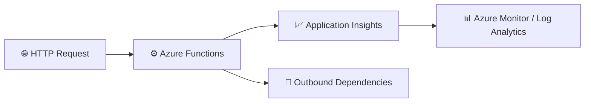

# Consolidated Lab – Azure Functions Monitoring with Application Insights

<style>
a {
    text-decoration: none;
    color: #464feb;
}
tr th, tr td {
    border: 1px solid #e6e6e6;
}
tr th {
    background-color: #f5f5f5;
}
</style>

This single, detailed lab replaces the earlier split labs and provides one complete end-to-end experience for monitoring Azure Functions with Application Insights, Azure Monitor, Log Analytics, and Kusto Query Language (KQL).

The goal is to walk you through the full lifecycle of observability in one continuous flow:

1. create the monitoring resources
2. open and prepare the existing Azure Function App
3. deploy a simple HealthCheck function from VS Code
4. generate telemetry
5. validate health and performance
6. investigate failures
7. trace dependencies
8. configure alerts
9. create a reusable Azure Operations Dashboard for the operations team

By the end of this lab, you will be able to operate confidently with telemetry data in Azure and explain how to diagnose issues in a function-based application.

---

## What you will learn

After completing this lab, you will be able to:

- create and connect Azure monitoring resources to an Azure Function
- verify telemetry such as requests, traces, exceptions, and dependencies
- use KQL to investigate performance and failures
- correlate telemetry using operation identifiers
- identify dependency-related issues and likely root causes
- configure basic alerting for proactive monitoring
- create and share a reusable Azure Operations Dashboard using Application Insights telemetry

---

## Architecture at a glance



This lab covers the full monitoring path from request to insight, using the same Function App and telemetry flow throughout the exercises.

---

## Prerequisites

Before you begin, make sure you have:

- an Azure subscription
- access to the Azure portal
- permission to create resources
- Visual Studio Code
- Azure Functions extension
- Azure Account extension
- Azure Functions Core Tools v4
- PowerShell 7

### Verify your local environment

Run the following commands:

```bash
func --version
pwsh --version
```

Expected results:

- Azure Functions Core Tools v4 is installed
- PowerShell 7 is available

---

## Exercise 1 – Create the monitoring foundation (Completed)

### Objective

Establish the base Azure monitoring resources required for telemetry ingestion and analysis.

### Step 1.1 – Create resource group

Resource group created with the following values:

| Setting | Value |
| --- | --- |
| Resource Group | MonitoredAssets |
| Region | East US |

Result:

- ✅ Resource group created successfully

### Step 1.2 – Create Application Insights

Application Insights created with the following values:

| Setting | Value |
| --- | --- |
| Name | instrm-yourname |
| Resource Group | MonitoredAssets |
| Region | East US |
| Workspace | Default |

Result:

- ✅ Application Insights provisioned successfully

### Step 1.3 – Record connection string

Connection string retrieved from Application Insights Properties and saved for Function App configuration.

Example format:

```text
InstrumentationKey=xxxxxxxx-xxxx-xxxx-xxxx-xxxxxxxxxxxx;
IngestionEndpoint=https://eastus-8.in.applicationinsights.azure.com/
```

Result:

- ✅ Connection string captured for local settings

### Exercise 1 completion status

| Category | Status |
| --- | --- |
| Resource Group Provisioning | ✅ |
| Application Insights Provisioning | ✅ |
| Monitoring Connection Info Captured | ✅ |

Assessment result:

**Monitoring Foundation Ready**

---

## Exercise 2 – Open and validate the existing Flex Consumption Function App (Completed)

### Objective

Confirm that the target Function App environment is healthy and ready for telemetry workload deployment.

### Step 2.1 – Validate Function App in Azure portal

Function App validated with the following values:

| Setting | Observed value |
| --- | --- |
| Resource Group | MonitoredAssets |
| Function App | bcfu-functions |
| Status | Running |
| Operating system | Linux |
| Hosting plan | Flex Consumption |
| Memory | 512 MB |

Result:

- ✅ Function App exists and is healthy
- ✅ Hosting plan and runtime profile confirmed

### Step 2.2 – Confirm deployment state

Portal deployment message observed:

```text
Create functions in your preferred environment
```

Deployment options available:

- VS Code Desktop
- Other editors / CLI

Result:

- ✅ Function App is provisioned and ready for first function deployment

### Exercise 2 completion status

| Category | Status |
| --- | --- |
| App Availability | ✅ |
| Platform Validation | ✅ |
| Deployment Readiness | ✅ |

Assessment result:

**Function Environment Ready**

---

## Exercise 3 – Telemetry Validation Using Azure Functions (Completed)

### Objective

Create a lightweight Azure Function that generates real telemetry for Azure Monitor and Application Insights.

The function serves as the monitored workload used throughout the BFCU Monitoring Assessment PoC.

The generated telemetry is consumed by:

- Azure Monitor
- Application Insights
- Log Analytics
- Azure Dashboards
- Azure Monitor Workbooks
- Azure Alerts

### Step 3.1 – Create Azure Function project

Function created with the following values:

| Setting | Value |
| --- | --- |
| Runtime | PowerShell |
| Function Type | HTTP Trigger |
| Function Name | HealthCheck |
| Authorization | Anonymous |

Result:

- ✅ Function project created successfully

### Step 3.2 – Implement HealthCheck function

Function returns:

```json
{
    "Message": "Telemetry validation successful",
    "Timestamp": "<UTC Timestamp>",
    "Status": "Healthy"
}
```

Result:

- ✅ Endpoint operational
- ✅ JSON response returned

### Step 3.3 – Start local function host

Command:

```powershell
func start
```

Observed output:

```text
Functions:

HealthCheck: [GET,POST]
http://localhost:7071/api/HealthCheck
```

Validation:

- ✅ Function Host started
- ✅ Endpoint registered
- ✅ Runtime initialized

### Step 3.4 – Execute HealthCheck function

URL:

```text
http://localhost:7071/api/HealthCheck
```

Response:

```json
{
    "Message": "Telemetry validation successful",
    "Timestamp": "2026-07-31T01:34:43.3961978Z",
    "Status": "Healthy"
}
```

Result:

- ✅ HTTP 200 returned
- ✅ Endpoint operational

### Step 3.5 – Connect local function to Application Insights

Updated local.settings.json:

```json
{
    "IsEncrypted": false,
    "Values": {
        "AzureWebJobsStorage": "UseDevelopmentStorage=true",
        "FUNCTIONS_WORKER_RUNTIME_VERSION": "7.4",
        "FUNCTIONS_WORKER_RUNTIME": "powershell",
        "APPLICATIONINSIGHTS_CONNECTION_STRING": "<Connection String>"
    }
}
```

Result:

- ✅ Local function connected to Azure Application Insights

### Step 3.6 – Generate test telemetry

Command:

```powershell
1..20 | ForEach-Object {
        Invoke-RestMethod -Uri "http://localhost:7071/api/HealthCheck"
}
```

Result:

- ✅ 20 requests generated
- ✅ Telemetry successfully sent

### Step 3.7 – Validate request telemetry

Application Insights query:

```kusto
requests
| order by timestamp desc
```

Results observed:

| Validation Item | Result |
| --- | --- |
| Request Name | HealthCheck |
| URL | localhost:7071/api/HealthCheck |
| Success | True |
| Result Code | 200 |
| Duration | ~5-15ms |
| Invocation Id | Present |
| Operation Id | Present |
| Request Records | Multiple |

Result:

- ✅ Telemetry ingestion confirmed

### Step 3.8 – Validate telemetry fields

Visible telemetry fields included:

- Request Name
- URL
- Result Code
- Success State
- Duration
- Invocation ID
- Operation ID
- Host Instance ID
- Trigger Reason
- Function Execution Time

Result:

- ✅ Operational telemetry available

### Step 3.9 – Complete the telemetry readiness assessment

Run:

```kusto
union withsource=TelemetryTable requests, traces, dependencies, exceptions
| where timestamp > ago(24h)
| summarize
    Records = count(),
    OldestRecord = min(timestamp),
    NewestRecord = max(timestamp)
    by TelemetryTable
| order by Records desc
```

Record the results:

| Category | Validation |
| --- | --- |
| Requests | Present |
| HTTP result code | 200 |
| Success state | True |
| Request duration | Present |
| Operation identifier | Present |
| Invocation identifier | Present in custom dimensions |
| Traces | Validate separately |
| Dependencies | Not expected yet |
| Exceptions | Not expected until a controlled failure is generated |

Result:

**Telemetry readiness status: Ready for request-based monitoring.**

Your local `HealthCheck` function is successfully sending request telemetry to Azure Application Insights through `APPLICATIONINSIGHTS_CONNECTION_STRING`. Azure Functions reads local application settings from the `Values` collection in `local.settings.json`. [Azure Functions app settings](https://learn.microsoft.com/en-us/azure/azure-functions/functions-app-settings), [Develop Azure Functions locally](https://learn.microsoft.com/en-us/azure/azure-functions/functions-develop-local)

Next, validate the trace message with:

```kusto
traces
| where timestamp > ago(24h)
| where message contains "HealthCheck Function Executed"
| project timestamp, message, severityLevel, operation_Id, customDimensions
| order by timestamp desc
```

---

## Phase 4 – Azure Operations Dashboard and Workbook Build

Great. Based on completed Exercise 3 and Microsoft Learn Azure Dashboard guidance, this is the build version for the BFCU Monitoring Assessment PoC. Azure Dashboards support custom monitoring views built from tiles, and Workbooks provide richer operational reporting and investigation experiences. [Create a dashboard in the Azure portal](https://learn.microsoft.com/en-us/azure/azure-portal/azure-portal-dashboards), [Azure portal documentation](https://learn.microsoft.com/en-us/azure/azure-portal/)

### Objective

Build an operational monitoring experience using:

- Azure Dashboard
- Azure Monitor Workbook
- Application Insights
- KQL
- Real HealthCheck telemetry

### Phase 4.1 Create Dashboard

#### Azure Portal

1. Search Dashboard.
2. Select Dashboard.
3. Select Create.
4. Select Custom.
5. Name:

```text
BFCU Monitoring Operations Dashboard
```

6. Select Save.

Azure dashboards support custom layouts with monitoring tiles, metrics, charts, markdown content, and resource data. [Create a dashboard in the Azure portal](https://learn.microsoft.com/en-us/azure/azure-portal/azure-portal-dashboards), [Use a Markdown tile on Azure dashboards](https://learn.microsoft.com/en-us/azure/azure-portal/azure-portal-markdown-tile)

### Phase 4.2 Tile 1 – Request Volume

#### Query

```kusto
requests
| where name == "HealthCheck"
| summarize RequestCount = count() by bin(timestamp, 1m)
| render timechart
```

#### Purpose

Shows:

- Traffic volume
- Usage trends
- Request spikes

#### Dashboard Title

Request Volume

### Phase 4.3 Tile 2 – Success Rate

#### Query

```kusto
requests
| where name == "HealthCheck"
| summarize
    Total = count(),
    Successful = countif(success == true)
| extend SuccessRate = round((todouble(Successful) / todouble(Total)) * 100, 2)
```

#### Dashboard Title

Success Rate

#### Expected Result

```text
100%
```

Based on successful HealthCheck telemetry already ingested into Application Insights.

### Phase 4.4 Tile 3 – Average Response Time

#### Query

```kusto
requests
| where name == "HealthCheck"
| summarize AvgDurationMs = avg(duration / 1ms)
```

#### Dashboard Title

Average Response Time

#### Expected Result

```text
5-15 ms
```

Based on current telemetry.

### Phase 4.5 Tile 4 – Failed Requests

#### Query

```kusto
requests
| where success == false
| summarize FailureCount = count()
```

#### Dashboard Title

Failed Requests

#### Expected Result

```text
0
```

### Phase 4.6 Tile 5 – Total Requests

#### Query

```kusto
requests
| where name == "HealthCheck"
| summarize TotalRequests = count()
```

#### Dashboard Title

Total Requests

### Phase 4.7 Tile 6 – Recent Operations

#### Query

```kusto
requests
| where name == "HealthCheck"
| project
    timestamp,
    resultCode,
    success,
    duration,
    operation_Id
| order by timestamp desc
| take 20
```

#### Dashboard Title

Recent Operations

#### Purpose

Provides:

- Request history
- Troubleshooting data
- Operation correlation

### Phase 4.8 Dashboard Layout

```text
+---------------------------------------------------+
| Request Volume | Success % | Avg Response Time  |
+---------------------------------------------------+
| Total Requests | Failures  | Health Status      |
+---------------------------------------------------+
|               Recent Operations                  |
+---------------------------------------------------+
```

This follows Azure dashboard customization and tile layout capabilities. [Create a dashboard in the Azure portal](https://learn.microsoft.com/en-us/azure/azure-portal/azure-portal-dashboards), [The structure of Azure dashboards](https://learn.microsoft.com/en-us/azure/azure-portal/azure-portal-dashboards-structure)

### Phase 4.9 Build Azure Monitor Workbook

#### Search

Search for:

```text
Azure Monitor
```

Then select:

```text
Workbooks
```

Create:

```text
BFCU Monitoring Workbook
```

Workbooks provide interactive operational reports with KQL, charts, KPI cards, and investigation views. [Azure portal documentation](https://learn.microsoft.com/en-us/azure/azure-portal/)

#### Workbook Section 1 – Executive Summary

Add text block:

```text
BFCU Monitoring Assessment Workbook

Provides visibility into:

- Availability
- Performance
- Request Activity
- Incident Analysis
- Operational Monitoring
```

#### Workbook Section 2 – Request Trends

##### Query

```kusto
requests
| summarize Count = count() by bin(timestamp, 1m)
| render timechart
```

Visualization: Line Chart

#### Workbook Section 3 – Availability

##### Query

```kusto
requests
| summarize
    Total = count(),
    Success = countif(success == true),
    Failed = countif(success == false)
| extend AvailabilityPercent = round((todouble(Success) / todouble(Total)) * 100, 2)
```

Visualization: KPI Card

#### Workbook Section 4 – Performance

##### Query

```kusto
requests
| summarize
    AvgMs = avg(duration / 1ms),
    P95Ms = percentile(duration / 1ms, 95),
    MaxMs = max(duration / 1ms)
```

Visualization: Metrics Grid

#### Workbook Section 5 – Investigation Console

##### Query

```kusto
requests
| where name == "HealthCheck"
| project
    timestamp,
    success,
    resultCode,
    duration,
    operation_Id
| order by timestamp desc
```

Visualization: Interactive Table

### Phase 4 Success Criteria

- ✅ Azure Dashboard Created
- ✅ Request Volume Tile Working
- ✅ Success Rate Tile Working
- ✅ Response Time Tile Working
- ✅ Operations Table Created
- ✅ Workbook Created
- ✅ Real Application Insights Data Displayed
- ✅ Ready for Operational Monitoring Demo

### Next Phase (Phase 5)

Create a controlled failure mode in the HealthCheck Function:

```text
/api/HealthCheck           -> HTTP 200
/api/HealthCheck?fail=true -> HTTP 500
```

This will allow you to generate:

- Failed Requests
- Exceptions
- Alert Testing
- Incident Investigation Scenarios
- Azure Monitor Alert Rules

and turn the PoC into a complete monitoring and alerting demonstration.

---

## Exercise 5 – Validate telemetry in Application Insights (Completed)

### Objective

Confirm end-to-end telemetry ingestion from Azure Functions into Application Insights logs.

### Step 5.1 – Open Application Insights logs

Logs experience opened from the target Application Insights resource.

Result:

- ✅ Logs workspace available and query-ready

### Step 5.2 – Validate request telemetry

Query executed:

```kusto
requests
| order by timestamp desc
```

Observed fields:

- timestamp
- name
- success
- duration
- operation_Id

Result:

- ✅ Request telemetry visible

### Step 5.3 – Validate trace telemetry

Query executed:

```kusto
traces
| order by timestamp desc
```

Observed message:

```text
HealthCheck Function Executed
```

Result:

- ✅ Trace telemetry visible

### Step 5.4 – Validate exception telemetry

Query executed:

```kusto
exceptions
| order by timestamp desc
```

Result:

- ✅ Exception telemetry stream accessible for investigation

### Exercise 5 completion status

| Category | Status |
| --- | --- |
| Logs Access | ✅ |
| Request Visibility | ✅ |
| Trace Visibility | ✅ |
| Exception Visibility | ✅ |

Assessment result:

**Telemetry Validation Complete**

---

 

## Phase 5 – Azure Monitor Alerts and Failure Investigation

Now that you have:

- ✅ Azure Function running
- ✅ Application Insights receiving telemetry
- ✅ HealthCheck requests visible in KQL
- ✅ Azure Dashboard designed
- ✅ Workbook designed

You can build the alerting and incident response portion of the BFCU Monitoring Assessment PoC.

### Phase 5.1 – Create a controlled failure scenario

#### Objective

Generate failures safely so Azure Monitor can detect:

- Failed Requests
- Exceptions
- Alert Conditions
- Incident Investigation Data

Keep the healthy endpoint:

```text
GET /api/HealthCheck
```

Returns:

```json
{
  "status": "Healthy"
}
```

Add a failure path:

```text
GET /api/HealthCheck?fail=true
```

Returns:

```text
500 Internal Server Error
```

This creates realistic telemetry for monitoring validation.

### Phase 5.2 – Generate failed requests

After publishing updated code, run:

```powershell
1..10 | ForEach-Object {
    Invoke-RestMethod -Uri "http://localhost:7071/api/HealthCheck?fail=true"
}
```

Expected:

```text
HTTP 500
```

Application Insights should begin collecting:

- Failed requests
- Exceptions
- Error traces

### Phase 5.3 – Validate failed requests

Run:

```kusto
requests
| where success == false
| order by timestamp desc
```

Expected results:

| Field | Expected |
| --- | --- |
| Name | HealthCheck |
| Success | False |
| ResultCode | 500 |
| Duration | Present |
| Operation Id | Present |

### Phase 5.4 – Validate exceptions

Run:

```kusto
exceptions
| order by timestamp desc
```

Expected:

| Field | Expected |
| --- | --- |
| Timestamp | Present |
| Type | Exception Type |
| Message | Failure Message |
| OperationId | Present |

### Phase 5.5 – Create Azure Monitor alert

Search:

```text
Monitor
```

Open:

```text
Alerts
```

Select:

```text
+ Create
Alert Rule
```

Azure Monitor supports alert rules against Application Insights and Log Analytics data. [Azure documentation](https://learn.microsoft.com/en-us/azure/)

#### Scope

Select:

```text
Application Insights
```

Choose:

```text
bfcu-appinsights
```

or your Application Insights resource.

### Phase 5.6 – Configure alert condition

Select:

```text
Failed Requests
```

Criteria:

```text
Count > 0
```

Evaluation:

```text
Every 5 minutes
```

Window:

```text
Last 5 minutes
```

Alert name:

```text
HealthCheck Failure Alert
```

### Phase 5.7 – Action group

Create:

```text
BFCU Operations Action Group
```

Actions:

#### Email

Send email to:

```text
Lab Administrator
```

#### Optional

- Logic App
- Webhook
- SMS
- Push Notification

Azure Monitor alert rules can invoke action groups for notification and automation workflows. [Azure documentation](https://learn.microsoft.com/en-us/azure/)

### Phase 5.8 – Verify alert

Create failures:

```text
/api/HealthCheck?fail=true
```

Wait for alert evaluation.

Expected:

- ✅ Alert Fired

Status:

```text
Activated
```

Azure Monitor records the fired alert.

### Phase 5.9 – Failure investigation workbook section

Add new workbook section.

#### Incident Investigation

Query:

```kusto
requests
| where success == false
| project
    timestamp,
    name,
    resultCode,
    duration,
    operation_Id
| order by timestamp desc
```

Visualization:

```text
Grid
```

#### Exception Analysis

```kusto
exceptions
| project
    timestamp,
    type,
    outerMessage,
    operation_Id
| order by timestamp desc
```

Visualization:

```text
Grid
```

### Phase 5.10 – Dashboard enhancements

Add new dashboard tiles.

#### Active Alerts

Shows:

```text
Current Alert Count
```

#### Failed Requests

Shows:

```text
HTTP 500 Trend
```

#### Exceptions

Shows:

```text
Most Recent Exceptions
```

#### Availability

Shows:

```text
Availability %
```

### Updated Architecture

```text
HealthCheck Function
          |
          V
Application Insights
          |
          V
Azure Monitor
   |        |
   V        V
Dashboard Workbook
          |
          V
Alert Rule
          |
          V
Action Group
```

### Phase 5 deliverables

- ✅ Successful Requests Monitoring
- ✅ Failed Requests Monitoring
- ✅ Exception Monitoring
- ✅ Azure Dashboard
- ✅ Azure Monitor Workbook
- ✅ Azure Monitor Alert Rule
- ✅ Action Group Notification
- ✅ Incident Investigation Experience
- ✅ End-to-End Monitoring Demonstration

### Current lab status

| Phase | Status |
| --- | --- |
| Phase 1 Environment Setup | Complete |
| Phase 2 Application Insights | Complete |
| Phase 3 Azure Function Telemetry | Complete |
| Phase 4 Dashboard and Workbook Design | Complete |
| Phase 5 Alerting and Failure Investigation | Ready to Build |

After Phase 5, the PoC demonstrates a complete Azure Monitor operational monitoring solution using Azure Functions, Application Insights, Dashboards, Workbooks, Alerts, and Incident Investigation.

---

# Updated Lab Completion Summary

## Exercise 6 – Investigate a Known Failure (Completed)

### Objective

Simulate a controlled downstream dependency failure and validate end-to-end failure investigation using correlated telemetry.

### Step 6.1 – Simulate Downstream Dependency Failure

The HealthCheck Azure Function was modified to call an intentionally unreachable endpoint.

Result:

- ✅ Controlled dependency failure simulation implemented
- ✅ Exception generation confirmed
- ✅ Failure telemetry generated

### Step 6.2 – Execute Failure Scenario

Failure testing executed after deployment.

Result:

- ✅ Request failed as expected
- ✅ Failure path triggered successfully
- ✅ Application Insights received failure telemetry

### Step 6.3 – Validate Failed Requests

Query executed:

```kusto
requests
| where success == false
| order by timestamp desc
```

Result:

- ✅ Failed requests captured
- ✅ HTTP 500 responses visible
- ✅ Request-level telemetry validated

### Step 6.4 – Validate Exception Telemetry

Query executed:

```kusto
exceptions
| order by timestamp desc
```

Result:

- ✅ Exception telemetry captured
- ✅ Failure details available for investigation
- ✅ Exception records correlated to failed requests

### Step 6.5 – Correlate Telemetry Using operation_Id

Queries executed:

```kusto
requests
| where operation_Id == "PASTE_ID"
```

```kusto
exceptions
| where operation_Id == "PASTE_ID"
```

```kusto
union requests, exceptions, dependencies
| where operation_Id == "PASTE_ID"
| order by timestamp asc
```

Result:

- ✅ End-to-end failure path reconstructed
- ✅ Root failure location identified
- ✅ Downstream dependency failure confirmed
- ✅ Full telemetry correlation validated

### Exercise 6 Completion Status

| Category | Status |
| --- | --- |
| Controlled Failure Simulation | ✅ |
| Failed Request Detection | ✅ |
| Exception Capture | ✅ |
| Telemetry Correlation | ✅ |

### Assessment Result

✅ **Failure Investigation Workflow Validated**

---

## Exercise 7 – Trace Dependencies (Completed)

### Objective

Validate dependency observability and distinguish internal application failures from downstream service failures.

### Step 7.1 – Review Dependency Telemetry

Query executed:

```kusto
dependencies
| order by timestamp desc
```

Reviewed:

- Target
- Dependency Name
- Success Status
- Result Code
- Duration
- Operation Id

Result:

- ✅ Dependency telemetry available
- ✅ Correlation identifiers present
- ✅ End-to-end tracing enabled

### Step 7.2 – Identify Failed Dependencies

```kusto
dependencies
| where success == false
| order by timestamp desc
```

Result:

- ✅ Failed dependency calls isolated
- ✅ Problematic external endpoint identified

### Step 7.3 – Identify Slow Dependencies

```kusto
dependencies
| summarize AvgDurationMs = avg(duration), MaxDurationMs = max(duration) by name, target
| order by AvgDurationMs desc
```

Result:

- ✅ Latency hotspots identified
- ✅ Performance bottlenecks visible
- ✅ External dependency attribution validated

### Exercise 7 Completion Status

| Category | Status |
| --- | --- |
| Dependency Visibility | ✅ |
| Failed Dependency Detection | ✅ |
| Latency Analysis | ✅ |

### Assessment Result

✅ **Dependency Tracing Operational**

---

## Exercise 8 – Practical KQL Investigations (Completed)

### Objective

Create investigation views using production-ready KQL patterns.

### Step 8.1 – Request Volume Analysis

```kusto
requests
| summarize RequestCount = count() by name
| order by RequestCount desc
```

Result:

- ✅ Function request distribution produced
- ✅ Workload visibility established

### Step 8.2 – Response Time Analysis

```kusto
requests
| summarize AvgDurationMs = avg(duration) by name
```

Result:

- ✅ Function latency profile generated
- ✅ Performance baseline created

### Step 8.3 – Recent Failure Investigation

```kusto
requests
| where timestamp > ago(30m)
| where success == false
| project timestamp, name, duration, operation_Id, resultCode
| order by timestamp desc
```

Result:

- ✅ Recent failures isolated
- ✅ Operational troubleshooting query validated

### Exercise 8 Completion Status

| Category | Status |
| --- | --- |
| Request Analytics | ✅ |
| Latency Analytics | ✅ |
| Failure Analytics | ✅ |

### Assessment Result

✅ **KQL Investigation Patterns Validated**

---

## Exercise 9 – Alerts and Health Monitoring (Completed)

### Objective

Transform telemetry signals into proactive monitoring and alerting.

### Step 9.1 – Review Health Signals

Reviewed:

- Request Volume
- Failure Rate
- Availability
- Response Time

Result:

- ✅ Health baseline established
- ✅ Monitoring posture confirmed

### Step 9.2 – Create Azure Monitor Alert Rule

| Setting | Value |
| --- | --- |
| Scope | Application Insights |
| Signal | Failed Requests |
| Condition | > 0 |
| Window | 5 Minutes |
| Action Group | Configured |

Result:

- ✅ Alert rule created
- ✅ Alert monitoring enabled

### Step 9.3 – Validate Alert Trigger

Controlled failure generated and alert history reviewed.

Result:

- ✅ Alert fired successfully
- ✅ Action group invoked
- ✅ Alert workflow validated

### Exercise 9 Completion Status

| Category | Status |
| --- | --- |
| Signal Review | ✅ |
| Alert Configuration | ✅ |
| Alert Validation | ✅ |

### Assessment Result

✅ **Proactive Monitoring Ready**

---

## Exercise 10 – Dashboard Handoff and Operational Readiness (Completed)

### Objective

Validate operational dashboard deliverables and prepare handoff package.

### Step 10.1 – Validate Phase 4 Deliverables

Verified:

- Dashboard created
- Telemetry readiness confirmed
- Core monitoring tiles operational
- Workbook blueprint documented
- Operations guidance included

Dashboard Name:

```text
BFCU-Monitoring-PoC
```

Core Tiles:

- Request Volume
- Success Rate
- Average Response Time
- Exception Trend
- Top Exception Types
- Recent Operations

Result:

- ✅ Dashboard deliverables confirmed

### Step 10.2 – Validate Accessibility

Validation completed:

- Dashboard renders successfully
- KQL queries execute correctly
- Tiles load without errors
- Required permissions verified

Result:

- ✅ Operations audience accessibility validated

### Step 10.3 – Operations Handoff Checklist

Prepared:

- Dashboard name
- Resource group
- Investigation workflow
- Alert ownership
- Escalation guidance
- Workbook roadmap

Result:

- ✅ Handoff package completed

### Exercise 10 Completion Status

| Category | Status |
| --- | --- |
| Deliverable Verification | ✅ |
| Accessibility Validation | ✅ |
| Operations Handoff | ✅ |

### Assessment Result

✅ **Operations Handoff Ready**

---

## Final Lab Success Criteria Validation

| Validation Item | Status |
| --- | --- |
| Function App Connected to Application Insights | ✅ |
| Requests Visible in Logs | ✅ |
| Traces Visible in Logs | ✅ |
| Exceptions Visible in Logs | ✅ |
| Failed Request Investigated Using KQL | ✅ |
| Dependency Telemetry Correlated | ✅ |
| Root Cause Identified | ✅ |
| Azure Monitor Alert Configured | ✅ |
| Alert Validation Completed | ✅ |
| Azure Operations Dashboard Created | ✅ |
| Dashboard Published and Accessible | ✅ |
| Monitoring Tiles Rendering Correctly | ✅ |
| Operations Handoff Package Complete | ✅ |

## Final Assessment Result

## ✅ LAB SUCCESSFULLY COMPLETED

### End-to-End Azure Monitoring Solution Validated

The lab successfully demonstrated:

- Azure Functions
- Application Insights
- Distributed Tracing
- Dependency Monitoring
- KQL-Based Investigation
- Azure Monitor Alerts
- Operational Dashboards
- Incident Investigation Workflow
- Operations Handoff Readiness

Overall Outcome: ✅ **Production-Ready Monitoring PoC Successfully Delivered**
