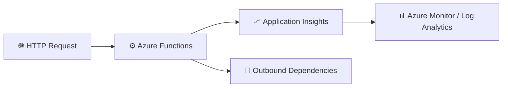

# Consolidated Lab – Azure Functions Monitoring with Application Insights

<style>
a {
    text-decoration: none;
    color: #464feb;
}
tr th, tr td {
    border: 1px solid #e6e6e6;
}
tr th {
    background-color: #f5f5f5;
}
</style>

This single, detailed lab replaces the earlier split labs and provides one complete end-to-end experience for monitoring Azure Functions with Application Insights, Azure Monitor, Log Analytics, and Kusto Query Language (KQL).

The goal is to walk you through the full lifecycle of observability in one continuous flow:

1. create the monitoring resources
2. open and prepare the existing Azure Function App
3. deploy a simple HealthCheck function from VS Code
4. generate telemetry
5. validate health and performance
6. investigate failures
7. trace dependencies
8. configure alerts
9. create a reusable Azure Operations Dashboard for the operations team

By the end of this lab, you will be able to operate confidently with telemetry data in Azure and explain how to diagnose issues in a function-based application.

---

## What you will learn

After completing this lab, you will be able to:

- create and connect Azure monitoring resources to an Azure Function
- verify telemetry such as requests, traces, exceptions, and dependencies
- use KQL to investigate performance and failures
- correlate telemetry using operation identifiers
- identify dependency-related issues and likely root causes
- configure basic alerting for proactive monitoring
- create and share a reusable Azure Operations Dashboard using Application Insights telemetry

---

## Architecture at a glance



This lab covers the full monitoring path from request to insight, using the same Function App and telemetry flow throughout the exercises.

---

## Prerequisites

Before you begin, make sure you have:

- an Azure subscription
- access to the Azure portal
- permission to create resources
- Visual Studio Code
- Azure Functions extension
- Azure Account extension
- Azure Functions Core Tools v4
- PowerShell 7

### Verify your local environment

Run the following commands:

```bash
func --version
pwsh --version
```

Expected results:

- Azure Functions Core Tools v4 is installed
- PowerShell 7 is available

---

## Exercise 1 – Create the monitoring foundation

### Step 1.1 – Create a resource group

1. Open the Azure portal.
2. Go to Resource Groups.
3. Select Create.
4. Use the following values:

| Setting | Value |
| --- | --- |
| Resource Group | MonitoredAssets |
| Region | East US |

5. Review and create the resource group.

✅ Expected result: the resource group is created successfully.

### Step 1.2 – Create Application Insights

1. In the Azure portal, search for Application Insights.
2. Select Create.
3. Use the following values:

| Setting | Value |
| --- | --- |
| Name | instrm-yourname |
| Resource Group | MonitoredAssets |
| Region | East US |
| Workspace | Default |

4. Review and create the resource.

✅ Expected result: Application Insights is provisioned.

### Step 1.3 – Record the connection string

1. Open your Application Insights resource.
2. Go to Properties.
3. Copy the Connection String value.
4. Save it for later use.

Example:

```text
InstrumentationKey=xxxxxxxx-xxxx-xxxx-xxxx-xxxxxxxxxxxx;
IngestionEndpoint=https://eastus-8.in.applicationinsights.azure.com/
```

---

## Exercise 2 – Open and validate the existing Flex Consumption Function App

### Step 2.1 – Open the Function App in Azure Portal

1. Sign in to the Azure portal.
2. Navigate to the resource group:

```text
MonitoredAssets
```

3. Open the Function App named:

```text
bcfu-functions
```

4. Verify the following settings:

| Setting | Expected value |
| --- | --- |
| Status | Running |
| Operating system | Linux |
| Hosting plan | Flex Consumption |
| Memory | 512 MB |

✅ Expected result: the Function App exists and is ready for deployment.

### Step 2.2 – Review the deployment experience

When you open the Function App, you should see the message:

```text
Create functions in your preferred environment
```

with deployment options including:

- VS Code Desktop
- Other editors / CLI

This confirms that the Function App has been created, but no function has been deployed yet.

---

## Exercise 3 – Create the telemetry source using Azure Functions in VS Code

### Objective

Create a simple Azure Function that generates telemetry in Application Insights and Azure Monitor.

This Azure Function becomes the monitored workload for:

- Telemetry Validation
- Failure Investigation
- Dependency Analysis
- Exception Analysis
- Dashboard Design
- Workbook Design
- Alert Validation

### Step 3.1 – Open Visual Studio Code

1. Open Visual Studio Code.
2. Install or confirm the following extensions are available:
   - Azure Functions
   - Azure Account

### Step 3.2 – Create a new Azure Functions project

1. Open the Command Palette.
2. Select:

```text
Azure Functions: Create New Project
```

3. Use the following values:

| Setting | Value |
| --- | --- |
| Language | PowerShell |
| Template | HTTP Trigger |
| Name | HealthCheck |
| Authorization | Anonymous |

### Step 3.3 – Review the generated files

VS Code creates the following project structure:

```text
host.json
HealthCheck/
├── function.json
└── run.ps1
```

Verify that the project structure exists before continuing.

### Step 3.4 – Implement the HealthCheck function

Replace the generated function code with the following PowerShell implementation:

```powershell
using namespace System.Net

param($Request, $TriggerMetadata)

Write-Host "HealthCheck Function Executed"

$body = @{

    status = "Healthy"

    message = "Telemetry validation successful"

} | ConvertTo-Json

Push-OutputBinding -Name Response -Value (

    [HttpResponseContext]@{

        StatusCode = [HttpStatusCode]::OK

        Body = $body

    }

)
```

This implementation generates:

- Requests: invocation telemetry
- Traces: HealthCheck Function Executed
- Duration: request execution duration
- Success: HTTP 200 response
- Correlation: operation Id generated automatically

### Step 3.5 – Deploy to Azure

1. In VS Code, open the Command Palette.
2. Select:

```text
Azure Functions: Deploy to Function App
```

3. Choose the Function App:

```text
bcfu-functions
```

4. Confirm the deployment.

✅ Expected result: deployment completes successfully.

### Step 3.6 – Validate function registration

1. Return to the Azure portal.
2. Open the Function App:

```text
bcfu-functions
```

3. Go to Functions.

Expected result:

- HealthCheck appears
- It is an HTTP Trigger
- It is enabled

This confirms Azure successfully indexed the function.

### Step 3.7 – Test the function

1. Open the function named HealthCheck.
2. Select Code + Test.
3. Select Test / Run.
4. Use the following values:

| Setting | Value |
| --- | --- |
| Method | GET |
| Body | Empty |

5. Select Run.

Expected response:

```json
{
  "status": "Healthy",
  "message": "Telemetry validation successful"
}
```

Expected status:

```text
HTTP 200 OK
```

### Step 3.8 – Generate telemetry

Run the function approximately 10–20 times.

This creates enough telemetry for the remaining exercises in this lab.

### Step 3.9 – Validate request telemetry

1. Open the Application Insights resource connected to the Function App.
2. Open Logs.
3. Run the following query:

```kusto
requests
| order by timestamp desc
```

Validate these fields:

- request name
- success status
- result code
- duration
- operation_Id

### Step 3.10 – Validate trace telemetry

Run the following query:

```kusto
traces
| order by timestamp desc
```

Expected result: messages such as:

```text
HealthCheck Function Executed
```

appear in the telemetry stream.

---

## Exercise 4 – Validate telemetry generation from the deployed function

### Step 4.1 – Invoke the function

1. Return to the Function App in the Azure portal.
2. Open the HealthCheck function.
3. Select Code + Test.
4. Run the function several times.

### Step 4.2 – Observe the response

You should see a response similar to:

```json
{
  "status": "Healthy",
  "message": "Telemetry validation successful"
}
```

### Step 4.3 – Confirm telemetry creation

After invoking the function, telemetry should begin flowing to Application Insights.

✅ Expected result: requests, traces, and related telemetry are generated for the same HealthCheck workload.

---

## Exercise 5 – Validate telemetry in Application Insights

At this point, the Function App is deployed and generating telemetry. The next steps show how to verify that the monitoring pipeline is working end to end.

### Step 5.1 – Open Application Insights logs

1. Go to your Application Insights resource.
2. Open Logs.

### Step 5.2 – Review requests

Run the following query:

```kusto
requests
| order by timestamp desc
```

Look for:

- timestamp
- name
- success
- duration
- operation_Id

### Step 5.3 – Review traces

Run:

```kusto
traces
| order by timestamp desc
```

Look for a message such as:

```text
HealthCheck Function Executed
```

### Step 5.4 – Review exceptions

Run:

```kusto
exceptions
| order by timestamp desc
```

✅ Expected result: telemetry is visible and can be inspected in the logs experience.

---

## Exercise 6 – Investigate a known failure

Once the baseline telemetry is visible, the next step is to create a controlled failure so you can practice investigating what the monitoring tools show.

### Step 6.1 – Simulate a downstream failure

Update the function to make an outbound HTTP call to an invalid endpoint so the request fails.

Example:

```csharp
using var client = new HttpClient();

try
{
    _logger.LogInformation("Calling downstream dependency");

    var response = await client.GetAsync("https://example.invalid/health");
    response.EnsureSuccessStatusCode();

    return req.CreateResponse(HttpStatusCode.OK);
}
catch (Exception ex)
{
    _logger.LogError(ex, "Dependency call failed");
    throw;
}
```

### Step 6.2 – Invoke the function again

1. Save the change.
2. Run the function from the portal.
3. Expect the request to fail.

### Step 6.3 – Query failed requests

Run:

```kusto
requests
| where success == false
| order by timestamp desc
```

### Step 6.4 – Review exception telemetry

Run:

```kusto
exceptions
| order by timestamp desc
```

### Step 6.5 – Correlate telemetry with operation_Id

Capture the operation_Id from the failed request and use it in the following queries:

```kusto
requests
| where operation_Id == "PASTE_ID"
```

```kusto
exceptions
| where operation_Id == "PASTE_ID"
```

```kusto
union requests, exceptions, dependencies
| where operation_Id == "PASTE_ID"
| order by timestamp asc
```

✅ Expected result: you can reconstruct the execution path and determine where the failure occurred.

---

## Exercise 7 – Trace dependencies

### Step 7.1 – Review dependency telemetry

Run:

```kusto
dependencies
| order by timestamp desc
```

Look for:

- target
- name
- success
- resultCode
- duration
- operation_Id

### Step 7.2 – Find failed dependencies

Run:

```kusto
dependencies
| where success == false
| order by timestamp desc
```

### Step 7.3 – Identify slow dependencies

Run:

```kusto
dependencies
| summarize AvgDurationMs = avg(duration), MaxDurationMs = max(duration) by name, target
| order by AvgDurationMs desc
```

✅ Expected result: you can tell whether the issue is inside the function or caused by an external dependency.

---

## Exercise 8 – Use KQL for practical investigations

### Step 8.1 – Count requests by function

```kusto
requests
| summarize RequestCount = count() by name
| order by RequestCount desc
```

### Step 8.2 – Average response time

```kusto
requests
| summarize AvgDurationMs = avg(duration) by name
```

### Step 8.3 – Show failures from the last 30 minutes

```kusto
requests
| where timestamp > ago(30m)
| where success == false
| project timestamp, name, duration, operation_Id, resultCode
| order by timestamp desc
```

✅ Expected result: you can turn raw logs into meaningful investigation views.

---

## Exercise 9 – Configure alerts and health monitoring

### Step 9.1 – Review health signals

1. Open your Application Insights resource.
2. Review the Overview and Metrics pages.
3. Look for request volume, failures, and availability information.

### Step 9.2 – Create an alert rule

1. Open Azure Monitor.
2. Go to Alerts.
3. Select Create and then Alert rule.
4. Choose your Function App or Application Insights resource as the scope.
5. Define a simple condition such as:
   - failed requests greater than 0
   - for a short time window such as 5 minutes
6. Add an action group and notification destination.
7. Save the alert rule.

### Step 9.3 – Validate the alert setup

Trigger a failure and verify that the alert becomes active or appears in alert history.

✅ Expected result: you understand how to turn telemetry into proactive operational monitoring.

---

## Exercise 10 – Create an Azure Operations Dashboard

This final exercise turns the telemetry you collected into an operational view that an operations team can reuse. The dashboard brings together request volume, failures, exception trends, recent failed operations, and an Application Map view so the monitoring story is visible in one place.

> Important note: the original demo references tables such as SecurityEvent, Heartbeat, and Perf. Those are not required for this Azure Functions lab. This exercise uses Application Insights telemetry directly.

### Step 10.1 – Confirm the right subscription and permissions

Before creating the dashboard, verify that you are in the correct Azure context.

1. Sign in to the Azure portal.
2. Use the Directory + subscription selector to confirm that you are in the intended Azure directory and subscription.
3. Verify that you have:
   - reader access to the Function App and Application Insights resource
   - permission to create dashboards
   - permission to create resources in the dashboard resource group

✅ Expected result: you are ready to create the dashboard in the correct subscription.

### Step 10.2 – Create a new dashboard

1. In the Azure portal menu, select Dashboard.
2. Choose Create.
3. Select Custom.
4. Enter the dashboard name:

```text
BFCU-Monitoring-PoC
```

5. In the Tile Gallery, add a Metric chart tile.
6. If available, also add an Application Map tile.
7. Optionally add additional tiles such as:
   - Markdown
   - Clock
   - Resource groups
   - Service Health

8. Arrange the tiles roughly to match your intended layout.
9. Select Save.

✅ Expected result: a new blank dashboard is created.

### Step 10.3 – Publish and share the dashboard

1. Open the dashboard named BFCU-Monitoring-PoC.
2. Select Share.
3. Keep the dashboard name as:

```text
BFCU-Monitoring-PoC
```

4. Choose the subscription where the dashboard resource should live.
5. Select an existing resource group or create a new one such as:

```text
rg-bfcu-monitoring-dashboards
```

6. Select Publish.
7. Use Azure RBAC to grant the appropriate users access to the dashboard resource or resource group.

✅ Expected result: the dashboard is published as a shared Azure resource.

> Note: Publishing the dashboard does not automatically grant access to the underlying Function App, Application Insights resource, or Log Analytics workspace. Dashboard users also need access to those resources.

### Step 10.4 – Configure a Function App or Application Insights metric tile

1. Open the dashboard.
2. Select Edit.
3. In the Metric chart tile, choose Configure or Edit in Metrics.
4. Set the metric scope using the relevant resource:

| Setting | Recommended value |
| --- | --- |
| Subscription | Your BFCU PoC subscription |
| Resource group | The resource group containing the Function App or Application Insights resource |
| Resource type | Function App or Application Insights |
| Resource | Your Function App or its connected Application Insights resource |

5. Choose a metric that is actually available in Metrics Explorer. Good choices include:
   - Requests
   - HTTP server errors
   - Average response time
   - Function execution count
   - Function execution units
   - Server requests
   - Failed requests
   - Server response time
   - Exceptions

6. Select an aggregation that fits the metric:
   - Count for request volume
   - Average for response duration
   - Sum or Count for failed operations

7. Give the tile a clear title such as:

```text
HealthCheck Request Volume
```

8. Select Save to dashboard.
9. Return to the main dashboard and save the changes.

✅ Expected result: the dashboard contains a metric tile that reflects the health of your function app.

### Step 10.5 – Configure Application Map

1. Return to the dashboard.
2. Select Edit.
3. In the Application Map tile, choose Configure tile.
4. Select the same subscription and resource group that contains the Application Insights resource.
5. Choose the Application Insights resource connected to your Function App.
6. Select Apply.
7. Save the dashboard.

✅ Expected result: the dashboard includes an Application Map view if telemetry and dependencies are available.

> If your environment only has a simple request flow with no recorded dependencies, the map may show only a single component. That is still useful because it confirms the visible telemetry boundary.

### Step 10.6 – Pin a request-volume query to the dashboard

1. Open the connected Application Insights resource.
2. Select Logs.
3. Use the query syntax that matches your environment.

For Application Insights table naming, use:

```kusto
requests
| where timestamp > ago(24h)
| summarize RequestCount = count()
    by bin(timestamp, 30m)
| order by timestamp asc
| render timechart
```

For workspace-style table naming, use:

```kusto
AppRequests
| where TimeGenerated > ago(24h)
| summarize RequestCount = count()
    by bin(TimeGenerated, 30m)
| order by TimeGenerated asc
| render timechart
```

4. After the chart renders, select Pin to dashboard.
5. Choose Azure Dashboard.
6. Select the dashboard subscription.
7. Choose BFCU-Monitoring-PoC.
8. Select Pin or Apply.

✅ Expected result: a time-chart tile for request volume appears on the dashboard.

### Step 10.7 – Pin failed-request activity

1. In the same Application Insights Logs experience, run the failed-request query.

For Application Insights table naming, use:

```kusto
requests
| where timestamp > ago(24h)
| where success == false
| summarize FailedRequests = count()
    by bin(timestamp, 30m)
| order by timestamp asc
| render timechart
```

For workspace-style table naming, use:

```kusto
AppRequests
| where TimeGenerated > ago(24h)
| where Success == false
| summarize FailedRequests = count()
    by bin(TimeGenerated, 30m)
| order by TimeGenerated asc
| render timechart
```

2. Pin the chart to the dashboard.
3. Use the title:

```text
Failed Function Requests
```

4. If the chart is empty, record the following note in your lab notes:

```text
No failed request telemetry was found in the selected time range.
```

✅ Expected result: the dashboard shows failed-request activity when telemetry exists.

> Do not treat an empty result as proof that there were no failures. It may simply mean that no matching telemetry was captured in the selected time range.

### Step 10.8 – Pin an exception trend

1. Run an exception trend query.

For Application Insights table naming, use:

```kusto
exceptions
| where timestamp > ago(24h)
| summarize ExceptionCount = count()
    by bin(timestamp, 30m)
| order by timestamp asc
| render timechart
```

For workspace-style table naming, use:

```kusto
AppExceptions
| where TimeGenerated > ago(24h)
| summarize ExceptionCount = count()
    by bin(TimeGenerated, 30m)
| order by TimeGenerated asc
| render timechart
```

2. Pin the chart to the dashboard with the title:

```text
Function Exception Trend
```

✅ Expected result: the dashboard shows the recent trend of exceptions.

### Step 10.9 – Pin the most common exception types

1. Run a query to show the most frequent exception categories.

For Application Insights table naming, use:

```kusto
exceptions
| where timestamp > ago(7d)
| summarize FailureCount = count() by type
| top 7 by FailureCount desc
| render piechart
```

For workspace-style table naming, use:

```kusto
AppExceptions
| where TimeGenerated > ago(7d)
| summarize FailureCount = count() by ExceptionType
| top 7 by FailureCount desc
| render piechart
```

2. Pin the chart and use the title:

```text
Top Exception Types
```

✅ Expected result: the dashboard includes a visual summary of the most common exception types.

> A pie chart pinned to an Azure Dashboard may render as a donut chart depending on the portal experience.

### Step 10.10 – Pin recent failed operations

1. Run a query that returns recent failed operations in tabular form.

For Application Insights table naming, use:

```kusto
requests
| where timestamp > ago(24h)
| where success == false
| project
    timestamp,
    name,
    resultCode,
    duration,
    operation_Id,
    cloud_RoleName
| order by timestamp desc
| take 20
```

For workspace-style table naming, use:

```kusto
AppRequests
| where TimeGenerated > ago(24h)
| where Success == false
| project
    TimeGenerated,
    Name,
    ResultCode,
    DurationMs,
    OperationId,
    AppRoleName
| order by TimeGenerated desc
| take 20
```

2. Pin the result as:

```text
Recent Failed Operations
```

✅ Expected result: the dashboard shows recent failed operations, including operation identifiers that can be used during deeper investigations.

### Step 10.11 – Add operational guidance with a Markdown tile

1. Return to the dashboard.
2. Select Edit.
3. Add a Markdown tile.
4. Paste the following content:

```markdown
# BFCU Monitoring Workloads PoC

## Operational workflow

1. Review failed requests.
2. Select a recent operation identifier.
3. Open Application Insights Logs.
4. Correlate requests, traces, dependencies, and exceptions.
5. Document the visible failure boundary.

## Lab scope

This dashboard provides monitoring evidence. It does not by itself prove root cause or business impact.
```

5. Save the tile.

✅ Expected result: the dashboard includes operational instructions and investigation context.

### Step 10.12 – Arrange and finalize the dashboard

1. Arrange the tiles in the following order:

| Row | Tiles |
| --- | --- |
| 1 | Function request volume, failed requests, average duration |
| 2 | Exception trend, top exception types |
| 3 | Recent failed operations |
| 4 | Application Map |
| 5 | Operational instructions and investigation links |

2. Resize tiles so they are readable.
3. Verify the time range on every pinned query.
4. Verify that each tile loads correctly for a user with access to the underlying resources.
5. Select Save or Publish changes.
6. Record the shared dashboard name and resource group for future reference.

✅ Expected result: the dashboard is ready for operational use.

---

## Success criteria

The lab is successful when all of the following are true:

- [x] the Function App is connected to Application Insights
- [x] requests, traces, and exceptions are visible in logs
- [x] a failing request can be investigated using KQL
- [x] dependency telemetry is available and correlated
- [x] you can describe the likely root cause of a failure
- [x] an alert rule has been configured or reviewed
- [x] an Azure Operations Dashboard has been created and published
- [x] relevant telemetry tiles such as request volume, failures, exceptions, and recent failed operations are pinned to the dashboard

---

## Summary

This consolidated lab shows how Azure Functions telemetry flows through Application Insights and Azure Monitor into actionable diagnostics. By combining setup, investigation, dependency tracing, KQL, and alerting in one guide, you get a practical view of how modern observability works in Azure.
