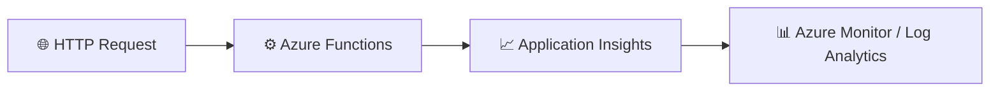

# Lab 01 – Telemetry Health Check

This lab provides a step-by-step walkthrough to verify that telemetry from Azure Functions is flowing correctly into Application Insights and Azure Monitor.

The goal is to confirm that your monitoring pipeline is healthy before moving to later troubleshooting labs. By the end of this lab, you will have:

- a working Azure Function
- an Application Insights resource connected to it
- verified telemetry for Requests, Traces, Exceptions, and Live Metrics
- a captured operation_Id for correlation in later labs

---

## What you will learn

After completing this lab, you will be able to:

- create an Application Insights resource
- create an Azure Function App
- connect Azure Functions to Application Insights
- generate telemetry
- validate Requests, Traces, and Exceptions
- use Live Metrics
- identify and use operation_Id for correlation
- prepare for Lab 02 failure investigation

---

## Architecture at a glance



Telemetry you will validate:

- Requests
- Dependencies
- Exceptions
- Traces
- Live Metrics

---

## Prerequisites

### Azure access

Make sure you have:

- an Azure subscription
- Contributor permissions
- access to the Azure portal

### Local tools

Install the following tools:

- Visual Studio Code
- Azure Functions extension
- Azure Functions Core Tools v4
- .NET 8 SDK

### Verify your setup

Run these commands in a terminal:

```bash
dotnet --list-sdks
```

Expected output:

```text
8.0.xxx
```

```bash
func --version
```

Expected output:

```text
4.x.x
```

---

## Exercise 1 – Create the monitoring resources

### Step 1.1 – Create a resource group

1. Open the Azure portal.
2. Navigate to Resource Groups.
3. Select Create.
4. Fill in the values:

| Setting | Value |
| --- | --- |
| Resource Group | MonitoredAssets |
| Region | East US |

5. Click Review + Create.
6. Click Create.

✅ Expected result: the resource group is created successfully.

### Step 1.2 – Create Application Insights

1. In the Azure portal, search for Application Insights.
2. Select Create.
3. Complete the form with the following values:

| Setting | Value |
| --- | --- |
| Name | instrm-yourname |
| Resource Group | MonitoredAssets |
| Region | East US |
| Workspace | Default |

4. Click Review + Create.
5. Click Create.

✅ Expected result: the Application Insights resource is created.

### Step 1.3 – Record the connection string

1. Open your new Application Insights resource.
2. Go to Properties.
3. Copy the Connection String value.

Example:

```text
InstrumentationKey=xxxxxxxx-xxxx-xxxx-xxxx-xxxxxxxxxxxx;
IngestionEndpoint=https://eastus-8.in.applicationinsights.azure.com/
```

4. Save this value for later use.

> Tip: You will use this connection information when connecting your function app to monitoring.

---

## Exercise 2 – Create the Azure Function App

### Step 2.1 – Create the Function App

1. In the Azure portal, go to Function Apps.
2. Select Create.
3. Configure the app using the following settings:

| Setting | Value |
| --- | --- |
| Runtime stack | .NET 8 |
| Hosting plan | Consumption |
| Operating system | Windows |
| Resource Group | MonitoredAssets |

4. Click Review + Create.
5. Click Create.

✅ Expected result: the Function App is deployed.

### Step 2.2 – Enable Application Insights during creation

1. In the create experience, go to the Monitoring section.
2. Enable Application Insights.
3. Select your Application Insights resource, such as instrm-yourname.
4. Continue the deployment and complete creation.

✅ Expected result: your Function App is deployed and connected to Application Insights.

---

## Exercise 3 – Create the HealthCheck function

### Step 3.1 – Create a new HTTP-triggered function

1. Open your Function App in the Azure portal.
2. Go to Functions.
3. Select Create.
4. Choose HTTP Trigger.

### Step 3.2 – Configure the function

Use the following values:

| Setting | Value |
| --- | --- |
| Name | HealthCheck |
| Authorization | Anonymous |

### Step 3.3 – Replace the generated code

Replace the generated function body with the following code:

```csharp
_logger.LogInformation("HealthCheck Function Executed");

var response = req.CreateResponse(HttpStatusCode.OK);
response.WriteString("Telemetry validation successful");

return response;
```

5. Click Save.

✅ Expected result: the HealthCheck function is deployed successfully.

---

## Exercise 4 – Generate telemetry

### Step 4.1 – Run the function

1. Open the function in the Azure portal.
2. Select Code + Test.
3. Choose Test/Run.

### Step 4.2 – Observe the response

You should receive:

```text
Telemetry validation successful
```

4. Run the function several times to create multiple telemetry events.

✅ Expected result: telemetry is generated in Application Insights.

---

## Exercise 5 – Validate Requests telemetry

### Step 5.1 – Open Application Insights Logs

1. Go to your Application Insights resource.
2. Open Logs.

### Step 5.2 – Run a Requests query

Execute the following query:

```kusto
requests
| order by timestamp desc
```

### Step 5.3 – Review the results

Look for the following fields:

- timestamp
- name
- operation_Id
- success
- duration

### Step 5.4 – Record the operation_Id

Find the most recent request and copy its operation_Id. You will use it later in Lab 02.

✅ Expected result: Request telemetry is visible in Application Insights.

---

## Exercise 6 – Validate Traces telemetry

### Step 6.1 – Run a traces query

In the same Logs experience, run:

```kusto
traces
| order by timestamp desc
```

### Step 6.2 – Review the output

Look for entries such as:

```text
HealthCheck Function Executed
```

Check for these fields:

- timestamp
- message
- severityLevel
- operation_Id

✅ Expected result: Trace telemetry is visible.

---

## Exercise 7 – Validate Exceptions telemetry

### Step 7.1 – Introduce a deliberate exception

Modify the function code to throw an exception:

```csharp
throw new Exception("Sample Failure");
```

Save the function.

### Step 7.2 – Run the function again

1. Invoke the function again.
2. Expect a response error.

✅ Expected result: the function returns a 500 Internal Server Error.

### Step 7.3 – Query exceptions in Application Insights

Run the following query:

```kusto
exceptions
| order by timestamp desc
```

### Step 7.4 – Review the exception data

Look for:

- Exception Type
- Message
- Timestamp
- operation_Id

✅ Expected result: Exception telemetry is visible.

---

## Exercise 8 – Correlate telemetry with operation_Id

The operation_Id is the key field used to correlate telemetry across a single request execution.

### Step 8.1 – Query requests by operation_Id

```kusto
requests
| where operation_Id == "PASTE_ID"
```

### Step 8.2 – Query traces by operation_Id

```kusto
traces
| where operation_Id == "PASTE_ID"
```

### Step 8.3 – Query exceptions by operation_Id

```kusto
exceptions
| where operation_Id == "PASTE_ID"
```

### Step 8.4 – View a combined timeline

```kusto
union requests, traces, exceptions
| where operation_Id == "PASTE_ID"
| order by timestamp asc
```

### Why operation_Id matters

operation_Id allows you to:

- link a request to its traces
- follow the execution flow
- identify related exceptions
- reconstruct a full transaction for investigation

This correlation capability is the foundation for Lab 02.

---

## Exercise 9 – Validate Live Metrics

### Step 9.1 – Open Live Metrics

1. Go to your Application Insights resource.
2. Open Live Metrics.

### Step 9.2 – Generate traffic

Run the HealthCheck function again several times.

### Step 9.3 – Observe the metrics

Watch for:

- Incoming Requests
- Request Rate
- Failed Requests
- Server Response Time

✅ Expected result: metrics update in real time.

---

## Success criteria

The lab is successful when all of the following are true:

- [x] the Function App runs successfully
- [x] telemetry appears in Application Insights
- [x] Requests telemetry is visible
- [x] Traces telemetry is visible
- [x] Exceptions telemetry is visible
- [x] Live Metrics updates in real time
- [x] you captured an operation_Id for later use

---

## Summary

This lab verifies that your monitoring setup is working end to end. If telemetry appears in Requests, Traces, Exceptions, and Live Metrics, your environment is ready for deeper troubleshooting in the next lab.

Requests visible	✅
Traces visible	✅
Exceptions visible	✅
Live Metrics active	✅
operation_Id captured	✅
Application Insights connected	✅
Evidence Collection

