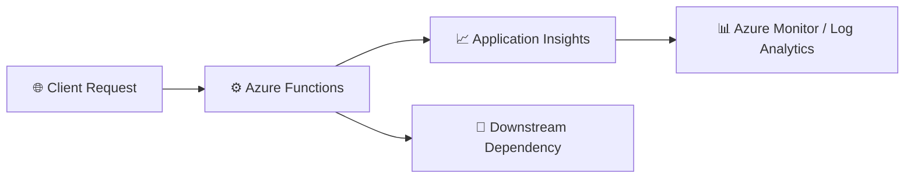

# Lab 02 – Known Failure Investigation

This lab walks through a practical investigation of a known failure in an Azure Function using Application Insights, Azure Monitor, and Kusto Query Language (KQL).

The goal is to show how to move from an observed failure to a root-cause hypothesis by using telemetry data such as failed requests, exceptions, dependency failures, and correlation fields like operation_Id.

By the end of this lab, you will be able to:

- reproduce a known failure in a Function App
- inspect failed requests in Application Insights
- review exception telemetry
- analyze dependency failures
- correlate telemetry using operation_Id
- identify the failure boundary and likely root cause

---

## What you will learn

After completing this lab, you will be able to:

- investigate failed requests in Application Insights
- use KQL to query telemetry data
- identify exceptions and dependency errors
- correlate traces and requests through operation_Id
- explain the point where the failure occurs

---

## Scenario

A function app is returning errors during a health check request. The service appears unhealthy, but the team needs to determine whether the issue is:

- an application exception
- a dependency failure
- a misconfiguration
- a broken downstream service

This lab uses the telemetry generated by the function to answer those questions.

---

## Architecture at a glance



You will investigate:

- failed requests
- exceptions
- dependency failures
- transaction correlation

---

## Prerequisites

Before starting this lab, make sure you have completed Lab 01 and that your Function App is still available in Azure.

You should also have:

- an Azure subscription
- access to the Azure portal
- access to Application Insights Logs
- a Function App that can be invoked
- at least one captured operation_Id from Lab 01

---

## Exercise 1 – Reproduce the known failure

### Step 1.1 – Update the function to simulate a dependency issue

Open the HealthCheck function and replace the implementation with a version that calls a failing endpoint.

Example:

```csharp
using var client = new HttpClient();

try
{
    _logger.LogInformation("Calling downstream dependency");

    var response = await client.GetAsync("https://example.invalid/health");
    response.EnsureSuccessStatusCode();

    return req.CreateResponse(HttpStatusCode.OK);
}
catch (Exception ex)
{
    _logger.LogError(ex, "Dependency call failed");
    throw;
}
```

### Step 1.2 – Save and run the function

1. Save the function code.
2. Invoke the function from the portal.
3. Expect the function to fail.

✅ Expected result: the request returns an error and generates telemetry in Application Insights.

> Note: The goal is not just to create an error, but to use telemetry to determine exactly what failed and where.

---

## Exercise 2 – Investigate failed requests

### Step 2.1 – Open Logs in Application Insights

1. Go to your Application Insights resource.
2. Open Logs.

### Step 2.2 – Query failed requests

Run the following query:

```kusto
requests
| where success == false
| order by timestamp desc
```

### Step 2.3 – Review the output

Look for these fields:

- timestamp
- name
- success
- duration
- operation_Id
- resultCode

✅ Expected result: you can see the failed request entry.

### Step 2.4 – Capture the operation_Id

Select the most recent failed request and copy the operation_Id. This will be used in later queries.

---

## Exercise 3 – Review exception telemetry

### Step 3.1 – Query exceptions

Run:

```kusto
exceptions
| order by timestamp desc
```

### Step 3.2 – Review the exception details

Look for:

- timestamp
- outerMessage
- type
- severityLevel
- operation_Id

### Step 3.3 – Interpret the result

You should see an exception indicating that something failed during execution. In this lab, the likely exception is related to the simulated dependency call.

✅ Expected result: exception telemetry is visible and linked to the failing request.

---

## Exercise 4 – Inspect dependency failures

### Step 4.1 – Query dependency telemetry

Run:

```kusto
dependencies
| order by timestamp desc
```

### Step 4.2 – Review the result

Look for fields such as:

- timestamp
- target
- name
- success
- resultCode
- operation_Id

### Step 4.3 – Identify the failure boundary

If the dependency call failed, you will likely see:

- a dependency entry for the outbound call
- a failure result code
- a failed dependency result

This helps determine whether the problem happened inside the function itself or in a downstream dependency.

✅ Expected result: dependency telemetry shows the failing external call.

---

## Exercise 5 – Correlate telemetry using operation_Id

### Step 5.1 – Query requests by operation_Id

Replace the placeholder with the operation_Id you captured earlier:

```kusto
requests
| where operation_Id == "PASTE_ID"
```

### Step 5.2 – Query exceptions by operation_Id

```kusto
exceptions
| where operation_Id == "PASTE_ID"
```

### Step 5.3 – Query dependencies by operation_Id

```kusto
dependencies
| where operation_Id == "PASTE_ID"
```

### Step 5.4 – View a combined timeline

```kusto
union requests, exceptions, dependencies
| where operation_Id == "PASTE_ID"
| order by timestamp asc
```

### Why this matters

This view helps you reconstruct the full execution path for a single request and understand how the failure propagated through the application.

---

## Exercise 6 – Identify the root cause

### Step 6.1 – Review the evidence

Use the telemetry you collected to answer the following questions:

- Did the request fail?
- Was there an exception logged?
- Was there a downstream dependency call?
- Did the dependency call fail before the function completed?
- What is the likely root cause?

### Step 6.2 – Form a hypothesis

A strong investigation statement might look like this:

> The function request failed because an outbound dependency call to an invalid endpoint returned an error. The failure appears in dependency telemetry and is also reflected in the exception and request records.

### Step 6.3 – Record your conclusion

Document your findings in a short summary:

- failing request name
- exception type
- dependency target
- operation_Id
- likely root cause

✅ Expected result: you can explain where the failure happened and why.

---

## Success criteria

The lab is successful when all of the following are true:

- [x] a failing request was generated
- [x] failed requests are visible in Application Insights
- [x] exception telemetry is visible
- [x] dependency telemetry is visible
- [x] requests, exceptions, and dependencies are correlated using operation_Id
- [x] you can describe the likely root cause of the failure

---

## Summary

This lab demonstrates how to investigate a known application failure using telemetry rather than guesswork. By correlating requests, exceptions, and dependencies, you can narrow the issue to a specific point in the execution flow and build a stronger root-cause hypothesis.
