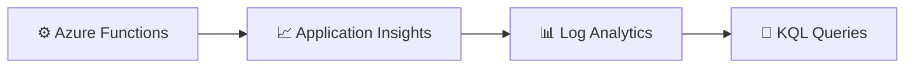

# Lab 03 – KQL Fundamentals

This lab introduces the basics of Kusto Query Language (KQL) for working with telemetry stored in Application Insights and Azure Monitor.

The goal is to help you query logs effectively and extract meaningful signals such as request count, failures, latency, and trends.

By the end of this lab, you will be able to:

- understand the structure of common telemetry tables
- run basic KQL queries in Application Insights Logs
- filter and sort telemetry records
- aggregate results to identify patterns
- use time-based queries to investigate behavior

---

## What you will learn

After completing this lab, you will be able to:

- query requests, traces, and exceptions with KQL
- filter results by time and success status
- calculate counts and averages
- use summarization to identify trends

---

## Scenario

Your telemetry is flowing into Application Insights, but you need a practical way to ask questions such as:

- how many requests failed today?
- what is the average response time?
- which functions are generating the most traces?
- which errors are occurring most often?

KQL is the language used to answer these questions.

---

## Architecture at a glance



---

## Prerequisites

Make sure you have completed Lab 01 and Lab 02, or that your environment already has telemetry available in Application Insights.

You should also have:

- access to Application Insights Logs
- one or more function invocations already recorded

---

## Exercise 1 – Review the basic telemetry tables

### Step 1.1 – Open Logs

1. Go to your Application Insights resource.
2. Open Logs.

### Step 1.2 – Run a simple query

```kusto
requests
| take 10
```

### Step 1.3 – Explore a few tables

Try each of the following:

```kusto
traces
| take 10
```

```kusto
exceptions
| take 10
```

✅ Expected result: you can see sample records from the telemetry tables.

---

## Exercise 2 – Filter results

### Step 2.1 – Filter requests by success

```kusto
requests
| where success == false
| order by timestamp desc
```

### Step 2.2 – Filter by time range

```kusto
requests
| where timestamp > ago(1h)
| order by timestamp desc
```

### Step 2.3 – Filter by function name

```kusto
requests
| where name == "HealthCheck"
| order by timestamp desc
```

✅ Expected result: the query returns only the records that match your conditions.

---

## Exercise 3 – Summarize telemetry

### Step 3.1 – Count requests by name

```kusto
requests
| summarize RequestCount = count() by name
| order by RequestCount desc
```

### Step 3.2 – Calculate average duration

```kusto
requests
| summarize AvgDurationMs = avg(duration) by name
```

### Step 3.3 – Count failures by function

```kusto
requests
| where success == false
| summarize FailedRequests = count() by name
```

✅ Expected result: you can aggregate telemetry into useful summaries.

---

## Exercise 4 – Build a simple investigation query

### Step 4.1 – Show recent failures with duration

```kusto
requests
| where timestamp > ago(30m)
| where success == false
| project timestamp, name, duration, operation_Id, resultCode
| order by timestamp desc
```

### Step 4.2 – Correlate with traces

```kusto
traces
| where timestamp > ago(30m)
| project timestamp, message, severityLevel, operation_Id
| order by timestamp desc
```

✅ Expected result: you can build a lightweight investigation view from multiple telemetry sources.

---

## Success criteria

The lab is successful when all of the following are true:

- [x] you can run KQL queries in Application Insights Logs
- [x] you can filter telemetry by time and outcome
- [x] you can summarize data with count and average operations
- [x] you can create a simple failure investigation query

---

## Summary

KQL is the main language for investigating telemetry in Azure Monitor. Once you understand filtering, sorting, and summarizing, you can turn raw logs into actionable operational insights.
