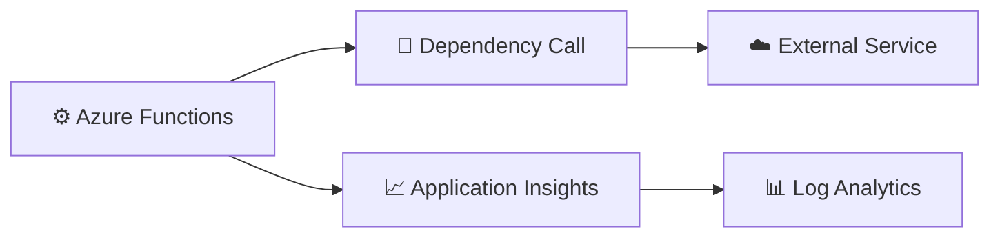

# Lab 04 – Dependency Tracing

This lab focuses on tracing outbound dependencies from Azure Functions and understanding how dependency failures affect request health.

The goal is to connect a function execution to its downstream calls so you can determine whether failures come from your app logic or from external systems.

By the end of this lab, you will be able to:

- inspect dependency telemetry in Application Insights
- identify slow or failing downstream calls
- correlate dependencies with requests and exceptions
- use dependency data to isolate the failure boundary

---

## What you will learn

After completing this lab, you will be able to:

- query dependency telemetry
- identify failed outbound requests
- correlate dependencies with the originating request
- reason about application performance and reliability

---

## Scenario

Your function calls a downstream service or API. The request is failing, but the telemetry shows that the issue may be related to an external dependency rather than the function itself.

This lab shows how to inspect dependency traces to confirm that hypothesis.

---

## Architecture at a glance



---

## Prerequisites

Make sure you have completed the earlier labs and that your Function App is generating dependency telemetry.

You should also have:

- access to Application Insights Logs
- a function that makes an outbound HTTP call

---

## Exercise 1 – Review dependency telemetry

### Step 1.1 – Query dependencies

Run the following query:

```kusto
dependencies
| order by timestamp desc
```

### Step 1.2 – Review the columns

Look for fields such as:

- timestamp
- name
- target
- success
- resultCode
- operation_Id

✅ Expected result: you can see dependency records created by the function.

---

## Exercise 2 – Find failed dependencies

### Step 2.1 – Filter failed dependencies

```kusto
dependencies
| where success == false
| order by timestamp desc
```

### Step 2.2 – Review the failure details

Focus on:

- target
- resultCode
- type
- duration
- operation_Id

✅ Expected result: you can identify dependency calls that failed.

---

## Exercise 3 – Correlate dependencies with requests

### Step 3.1 – Query requests and dependencies together

```kusto
union requests, dependencies
| where operation_Id == "PASTE_ID"
| order by timestamp asc
```

### Step 3.2 – Interpret the timeline

The timeline should help you answer whether the function succeeded until the dependency call, or whether the failure happened earlier.

✅ Expected result: you can connect dependency activity to a specific request lifecycle.

---

## Exercise 4 – Identify slow dependencies

### Step 4.1 – Query dependency duration

```kusto
dependencies
| summarize AvgDurationMs = avg(duration), MaxDurationMs = max(duration) by name, target
| order by AvgDurationMs desc
```

### Step 4.2 – Investigate the slowest dependency

Select the dependency with the highest duration and evaluate whether it is likely affecting request performance.

✅ Expected result: you can identify dependencies that are adding latency.

---

## Success criteria

The lab is successful when all of the following are true:

- [x] dependency telemetry is visible
- [x] failed dependencies can be identified
- [x] dependencies are correlated with a request using operation_Id
- [x] you can explain the impact of a slow or failing dependency

---

## Summary

Dependency tracing lets you see whether a problem is inside your function code or in an upstream or downstream service. This is essential for distinguishing application issues from infrastructure or service issues.
