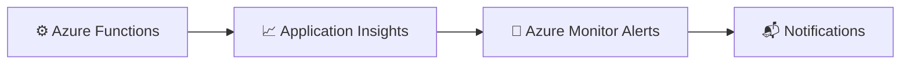

# Lab 05 – Alerts and Health Monitoring

This lab introduces alerting and health monitoring concepts for Azure Functions using Azure Monitor and Application Insights.

The goal is to show how to detect failures early, receive notifications, and monitor the health of your function app before issues affect users.

By the end of this lab, you will be able to:

- create a basic alert rule
- monitor failed requests and availability
- understand alert severity and scope
- review alert history and notifications

---

## What you will learn

After completing this lab, you will be able to:

- configure an alert in Azure Monitor
- use Application Insights metrics for health monitoring
- understand the purpose of availability tests and alert rules
- respond to health signals proactively

---

## Scenario

Your function app is running, but you want to be notified when failures spike or when the app becomes unavailable. This lab shows how to create a simple alert that flags a high failure rate.

---

## Architecture at a glance

---

## Prerequisites

Make sure you have:

- an Azure subscription
- access to Azure Monitor
- an Application Insights resource connected to your function app

---

## Exercise 1 – Review health signals

### Step 1.1 – Open Application Insights

1. Go to your Application Insights resource.
2. Open the Overview page.
3. Review the health and request metrics available there.

### Step 1.2 – Review availability

Check whether there are existing availability tests or monitoring signals already configured.

✅ Expected result: you can see health-related metrics and monitoring information.

---

## Exercise 2 – Create an alert rule

### Step 2.1 – Open Azure Monitor

1. In the Azure portal, open Azure Monitor.
2. Navigate to Alerts.
3. Select Create.
4. Choose Alert rule.

### Step 2.2 – Configure the alert scope

Select the target resource:

- your Function App or Application Insights resource

### Step 2.3 – Define the condition

Use a simple condition such as:

- Failed requests greater than 0
- over a short time window such as 5 minutes

### Step 2.4 – Set the action group

1. Create or select an action group.
2. Add an email notification or other alert destination.
3. Save the alert rule.

✅ Expected result: an alert rule is created and ready to trigger.

---

## Exercise 3 – Validate the alert setup

### Step 3.1 – Trigger a failure

Invoke the function in a way that causes a failure or simulate a failed request.

### Step 3.2 – Review alert activity

1. Go back to Azure Monitor Alerts.
2. View the alert history or fired alerts.

✅ Expected result: the alert is triggered or becomes active based on the condition.

---

## Exercise 4 – Review health monitoring best practices

A healthy monitoring strategy often includes:

- availability tests
- failure-rate alerts
- dependency failure alerts
- response-time thresholds
- notifications routed to the right team

✅ Expected result: you understand how alerts fit into an end-to-end monitoring approach.

---

## Success criteria

The lab is successful when all of the following are true:

- [x] you can navigate to Azure Monitor Alerts
- [x] you create or configure an alert rule
- [x] you understand how alerts are triggered
- [x] you can describe how health monitoring helps reduce downtime

---

## Summary

Alerts turn monitoring data into actionable operations. When combined with telemetry, they help teams respond quickly to issues before users are significantly impacted.
